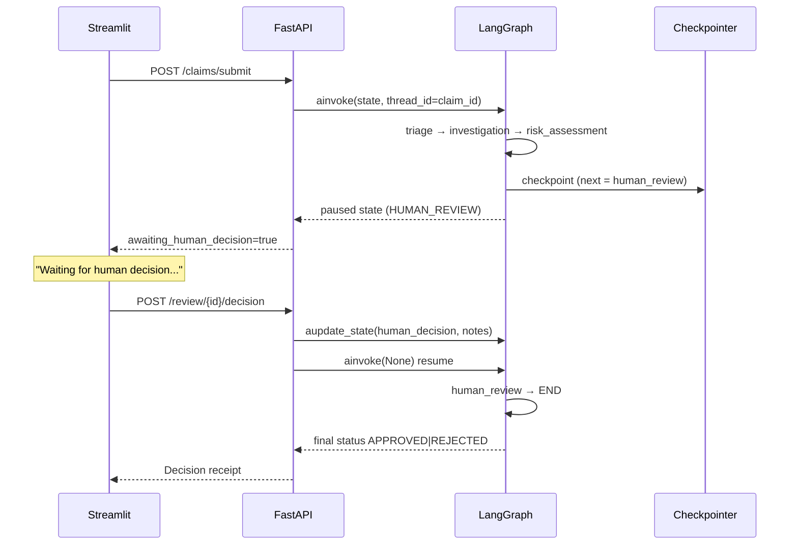

# LangGraph Human-in-the-Loop — Interrupt / Resume

> Claimflow pauses the agent graph **before** the `human_review` node and resumes only after an adjuster decision.

---

## Why interrupt (not a terminal stamp)?

Older implementations marked `status=HUMAN_REVIEW` and ended the graph immediately. That looks like HITL in the UI, but the orchestration never actually waited.

With `interrupt_before=["human_review"]`:

1. The pipeline runs `triage → investigation → risk_assessment`.
2. When routing selects `human_review`, LangGraph **checkpoints** and **stops** before that node runs.
3. The API returns `awaiting_human_decision=true` / `graph_interrupted=true`.
4. An adjuster posts `POST /api/v1/review/{claim_id}/decision`.
5. The API calls `aupdate_state` with the decision, then `ainvoke(None)` to **resume**.
6. `human_review` applies the decision → `END`.

This is the standard LangGraph HITL pattern used in production agents.

---

## Sequence



---

## Code map

| Piece | Location |
|-------|----------|
| Compile with interrupt | `build_claim_graph(... interrupt_before=["human_review"])` in `agents/graph.py` |
| Detect pause | `is_awaiting_human_review(graph, claim_id)` |
| Resume | `resume_with_human_decision(graph, claim_id, decision=...)` |
| Submit marks pause | `api/routes/claims.py` after `ainvoke` |
| Decision resumes | `api/routes/review.py` → `aupdate_state` + `ainvoke` |
| Checkpointer | `core/checkpoint.py` — `InMemorySaver` or Postgres |
| UI banner | `streamlit_app.py` — “Waiting for human decision…” |

`thread_id` is always the `claim_id`, so one claim maps to one interruptible conversation.

---

## API contract extras

`ClaimResponse` / claim payload may include:

| Field | Meaning |
|-------|---------|
| `awaiting_human_decision` | UI should show the waiting banner + decision controls |
| `graph_interrupted` | Checkpoint has `next` containing `human_review` |
| `status=HUMAN_REVIEW` | Business status while paused |

Auto-approved / auto-rejected claims never set these flags (no interrupt on those branches).

---

## Failure modes

| Scenario | Behaviour |
|----------|-----------|
| In-memory checkpointer + process restart | Interrupt lost → review API still persists decision via `ClaimStore.apply_decision` (store fallback) |
| Duplicate decision | HTTP 409 |
| Decision on non-`HUMAN_REVIEW` status | HTTP 409 |
| Postgres checkpointer configured | Interrupt survives restarts (`LANGGRAPH_CHECKPOINT_URL` / `DATABASE_URL`) |

---

## Demo tip

1. Load Streamlit **Example 1: Obvious Fraud** (or any high-risk MockLLM path).
2. Submit → status shows **Waiting for human decision…**.
3. Approve or Reject → graph resumes; receipt shows final status.

For judges: call `/health`, submit a claim, then inspect logs for:

```
LangGraph paused before human_review (interrupt_before)
LangGraph resumed after human decision
```
