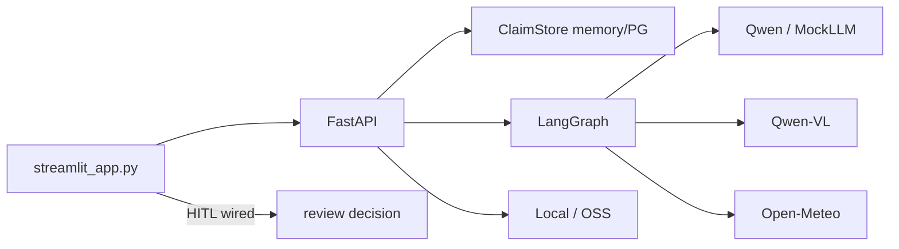

# Claimflow — Auditoria Técnica Completa

> **Data:** 2026-07-14  
> **Versão do código auditada:** 0.1.0  
> **Escopo:** inventário, funcionalidade, segurança, falhas, lacunas e recomendações  
> **Suite de testes no momento da auditoria:** **53 passed**

---

## Sumário executivo

Claimflow é um **MVP sólido e demonstrável** de autopilot de sinistros: FastAPI + LangGraph (6 nós) + Streamlit + DashScope/Qwen + Open-Meteo + storage local/OSS + fail-closed + modo MockLLM transparente.

| Dimensão | Nota | Avaliação |
|----------|------|-----------|
| Funcionalidade core (demo) | **9/10** | Pipeline e HITL API funcionam end-to-end |
| Segurança (produção) | **4/10** | Sem auth; uploads abertos; superfície pública ampla |
| Resiliência / fail-closed | **8/10** | Forte, com quirks em weather e OSS+vision |
| Testes | **7.5/10** | 53 verdes; falta e2e de submit e path OSS |
| Documentação | **8/10** | Rica, mas parcialmente desatualizada |
| Ops / entrega | **6/10** | Sem CI/Docker; screenshot do README presente; vídeo ainda pendente |

**Veredito:** pronto para **demo de hackathon** (com `USE_MOCK_LLM=true` e storage local). **Não** está pronto para exposição em rede nem para produção.

---

## 1. Inventário — o que existe

### 1.1 Entry points

| Componente | Caminho | Função |
|------------|---------|--------|
| API FastAPI | `src/claimflow/api/main.py` | ASGI, CORS, lifespan, mount `/uploads`, `:8000` |
| CLI | `pyproject.toml` → `claimflow.api.main:run` | uvicorn |
| Frontend | `streamlit_app.py` | Dashboard HITL (hardcoded `localhost:8000`) |
| Makefile | `Makefile` | install / run / test / coverage / lint / clean |

### 1.2 Superfície HTTP (`/api/v1`)

| Método | Rota | Auth | Arquivo |
|--------|------|------|---------|
| GET | `/health` | Nenhuma | `api/routes/health.py` |
| POST | `/claims/submit` | Nenhuma | `api/routes/claims.py` |
| POST | `/uploads` | Nenhuma | `api/routes/uploads.py` |
| GET | `/review/queue` | Nenhuma | `api/routes/review.py` |
| GET | `/review/{claim_id}` | Nenhuma | `api/routes/review.py` |
| POST | `/review/{claim_id}/decision` | Nenhuma | `api/routes/review.py` |
| GET | `/uploads/*` (static) | Nenhuma | mount em `main.py` |

### 1.3 Pipeline LangGraph

```
START → triage → investigation → risk_assessment
            → human_review | approval | rejected → END
```

| Nó | Responsabilidade | Módulo |
|----|------------------|--------|
| `triage` | Extração estruturada + Qwen-VL (opcional) | `agents/graph.py` |
| `investigation` | `ToolDecision` → Open-Meteo | idem |
| `risk_assessment` | Scores + fail-closed + routing | idem |
| `human_review` | Marca status e termina (não pausa o grafo) | idem |
| `approval` / `rejected` | Terminais automáticos | idem |

### 1.4 Serviços e integrações

| Área | Implementação |
|------|----------------|
| LLM texto | `services/llm_service.py` — ChatTongyi + fallback + MockLLM |
| Cenários demo | `services/mock_scenarios.py` — STORM / FRAUD / AMBIGUOUS |
| Vision | `services/vision_service.py` — Qwen-VL + mock de fallback |
| Weather | `tools/weather_tool.py` — Open-Meteo |
| Storage | Strategy: `local_storage.py` / `oss_storage.py` + `factory.py` |
| Persistência | `claim_store.py` — memória ou Postgres |
| Checkpoints | `core/checkpoint.py` — InMemory ou AsyncPostgresSaver |
| Alibaba health | `alibaba_cloud_integration.py` + `/health` |
| Config | `core/config.py` + `.env.example` (`SecretStr`) |

### 1.5 Documentação e artefatos

| Presente | Ausente / quebrado |
|----------|-------------------|
| `README.md`, `LICENSE` (MIT), `CHECKLIST.md` | `.github/` (CI) |
| `docs/architecture.md` + `.png` | `Dockerfile` / `docker-compose.yml` |
| `docs/DEPLOYMENT.md`, `ALIBABA_CLOUD_PROOF.md` | `docs/demo-recording.mp4` final |
| `docs/proof/*.png` (screenshots) | `docs/PROJECT_STATUS.md` **desatualizado** |
| `docs/screenshot.png` | — |
| Docs MockLLM / feature flag | — |

---

## 2. O que funciona

- Submissão multipart → LangGraph → `ClaimResponse` JSON.
- Triagem + investigação climática + risco + routing por thresholds (`RISK_THRESHOLD`, `REJECT_THRESHOLD`).
- Cadeia de fallback LLM e MockLLM com 3 cenários determinísticos (feature flag `USE_MOCK_LLM`).
- Vision local (arquivo no disco) + score de consistência texto↔imagem.
- HITL no Streamlit **conectado** a `POST /review/{id}/decision` (recibo + audit trail).
- Fail-closed em falhas de LLM/vision/`extracted_data` vazio (escala, não auto-aprova).
- Storage local + cliente OSS; health check DashScope/RAM/OSS.
- **53 testes passando** (graph, weather, vision, storage, LLM, mock graph, review, health).

---

## 3. O que não está funcional ou está parcial

### 3.1 Crítico / alto impacto

| Item | Evidência | Efeito |
|------|-----------|--------|
| **Vision com `STORAGE_BACKEND=oss` quebrada** | `_resolve_image_path` em `claims.py` retorna só o filename quando não é `LocalStorage`; `VisionService` exige path local | Análise visual falha → mock/penalidade; multimodal OSS não é e2e |
| **`USE_MOCK_LLM` não cobre Vision** | `vision_service.py` sempre tenta DashScope e só cai em mock em erro | Demo “offline” ainda bate (ou falha) na API de visão |

### 3.2 Quirks de comportamento (funciona, mas inconsistente)

| Quirk | Detalhe |
|-------|---------|
| Weather fail-closed furado | Open-Meteo em erro devolve `{"error": ...}` sem raise; `weather_verification` fica truthy → **não** aplica penalidade +0.2 de “verification unavailable” (`graph.py` `_compute_fail_closed_penalties`) |
| HITL não é interrupt LangGraph | Nó `human_review` termina o grafo; não há `interrupt_before` / resume. Docs que sugerem “pausa” exageram o mecanismo |
| Review pode sobrescrever APPROVED/REJECTED | `_DECIDABLE_STATUSES` inclui statuses já finalizados, sem auth |
| Queue `total` | `total=len(items)` da página, não contagem global |
| Docs drift | `PROJECT_STATUS.md` ainda fala em HITL não wired / 47–48 testes — supersedido |

### 3.3 Limitações aceitáveis para hackathon

- Claim store / checkpoints em memória por padrão (perda no restart).
- Streamlit API URL hardcoded.
- Sem domínio completo de seguros (apólice, cobertura, payout, duplicatas).

---

## 4. Segurança

### 4.1 Crítico

| # | Achado | Evidência | Impacto |
|---|--------|-----------|---------|
| S1 | **Nenhuma autenticação/autorização** na API | Rotas só com `Depends(get_claim_*)` | Qualquer um na rede submete claims, lista fila, decide sinistros |
| S2 | **Upload anônimo + estático público** | `uploads.py` + `StaticFiles` em `/uploads` | Dump de arquivos + exposição de fotos de sinistro (PII) |
| S3 | **Decisão humana aberta** | `POST /review/.../decision` sem auth; permite alterar APPROVED/REJECTED | Fraude operacional trivial |

### 4.2 Alto

| # | Achado | Evidência |
|---|--------|-----------|
| S4 | Sem limite de tamanho de upload | `await file.read()` sem cap — DoS em memória |
| S5 | Validação de tipo fraca em claims | Se `content_type` for falsy, allowlist é **pulada** (`claims.py`) |
| S6 | `/uploads` sem allowlist de MIME/extensão | Aceita qualquer bytes |
| S7 | Bind `0.0.0.0` | Expõe API na LAN/WAN se host tiver rede |
| S8 | PII em logs e APIs de review | Nome do cliente, texto bruto, payload completo sem ACL |
| S9 | Health pode vazar trecho de erro do provedor | `response.text[:200]` em falhas DashScope |

### 4.3 Médio / baixo

| # | Achado |
|---|--------|
| S10 | CORS: defaults omitem `:8501`; `allow_methods/headers=["*"]` + credentials |
| S11 | OpenAPI/docs sempre habilitados (descoberta de superfície) |
| S12 | Sem rate limiting (abuso de custo DashScope) |
| S13 | Credenciais via `SecretStr` + `.env` gitignored — **bom**; verificar histórico git antes de publicar |
| S14 | Weather usa URLs fixas Open-Meteo — risco SSRF baixo |
| S15 | Path traversal mitigado com `Path(filename).name` |

---

## 5. Mapa: implementado × faltando

### Implementado (demo-ready)

- [x] API REST + Streamlit HITL wired  
- [x] LangGraph 6 nós + thresholds  
- [x] Qwen texto + fallback + MockLLM transparente  
- [x] Qwen-VL (local) + consistência  
- [x] Open-Meteo  
- [x] Storage local/OSS (cliente)  
- [x] Fail-closed principal  
- [x] Health Alibaba  
- [x] Licença MIT + arquitetura + DEPLOYMENT + proof docs  

### Parcial

- [~] OSS + vision e2e  
- [~] MockLLM multimodal  
- [~] Persistência Postgres como default  
- [~] Hardening de upload  
- [~] Scripts de demo / vídeo final empacotado  
- [~] Docs de status (sincronizar)  

### Faltando (produção / claim de hackathon mais forte)

| Área | Lacuna |
|------|--------|
| Segurança | Auth (API key / JWT), RBAC, audit imutável |
| Domínio | Apólice, limites, payout, duplicata, ID do segurado |
| Ops | Docker, compose, CI, lockfile de deps |
| Observabilidade | Métricas, tracing, redação de PII |
| Testes | `test_claims_submit.py`, OSS+vision, weather error→fail-closed |
| Entrega | Vídeo YouTube/Devpost; screenshots em `docs/proof/` |

---

## 6. Testes — cobertura e gaps

**Estado:** 53 testes passando.

| Arquivo (aprox.) | Cobertura |
|------------------|-----------|
| `test_graph.py` | Nós, routing, fail-closed |
| `test_mock_graph.py` / `test_llm_fallback.py` | MockLLM |
| `test_vision_service.py` | Vision + mock fallback |
| `test_weather_tool.py` | Open-Meteo |
| `test_storage.py` / `test_oss_storage.py` | Storage |
| `test_review.py` | Fila / decisão |
| `test_health.py` | Health isolado |

**Gaps de alto valor:**

1. Sem teste HTTP de `POST /claims/submit`  
2. Sem teste do bug OSS → vision (`_resolve_image_path`)  
3. Sem teste de weather `{"error":...}` vs fail-closed  
4. Sem testes Postgres / checkpoint  
5. Sem testes do Streamlit (contrato UI↔API)  
6. Coverage tool existe (`make coverage`) sem badge/gate  

---

## 7. Ops e entrega

| Item | Status |
|------|--------|
| `.env.example` + `make install/run/test` | OK |
| Dockerfile / compose | Ausente |
| GitHub Actions | Ausente |
| Lockfile (`uv.lock` / `requirements.txt` pinado) | Ausente |
| `ENVIRONMENT=production` hardening (docs off, bind local) | Parcial |
| Multi-worker com store em memória | Não seguro |

---

## 8. Sugestões priorizadas

### P0 — antes de qualquer exposição em rede / demo pública

1. **Auth mínima** (`X-API-Key` ou Basic) em `/claims`, `/uploads`, `/review/*`; sanitizar erros do `/health`.  
2. **Cap de upload** (ex.: 10 MB) + validar extensão **e** MIME (+ magic bytes se possível).  
3. **Restringir decisões HITL** a `HUMAN_REVIEW` (override só com role elevado).  
4. **Corrigir path OSS→vision**: download para temp file (ou URL suportada pelo DashScope) antes do `VisionService`.  
5. **Fail-closed weather**: tratar `weather_verification.get("error")` como verificação ausente.

### P1 — credibilidade no hackathon

6. Honrar `USE_MOCK_LLM` também no `VisionService` (demo 100% determinística).  
7. Finalizar vídeo de demo e publicá-lo no YouTube / Devpost.  
8. Manter `docs/screenshot.png` atualizado; sincronizar `PROJECT_STATUS.md` com a realidade.  
9. `test_claims_submit.py` + teste negativo OSS/vision.  
10. Incluir `http://localhost:8501` em `CORS_ORIGINS` default.

### P2 — produção

11. Rate limit; desabilitar OpenAPI em produção; bind `127.0.0.1` no local.  
12. Postgres + compose por default; corrigir `total` da fila.  
13. CI (lint + test + coverage gate); pin de deps.  
14. Se a narrativa for “ajuste pausa o grafo”: `interrupt_before=["human_review"]` de verdade.  
15. Redação de PII nos logs estruturados.

---

## 9. Diagrama do estado atual



---

## 10. Checklist rápido de go/no-go

| Critério | Go? |
|----------|-----|
| Demo local com MockLLM + storage local | **GO** |
| Demo com Qwen live (creds válidas) | **GO** (validar chave/modelos antes) |
| Demo com OSS + vision | **NO-GO** até corrigir path |
| Deploy público sem auth | **NO-GO** |
| Submissão Devpost com vídeo final + screenshot README | **Parcial** |

---

## 11. Referências cruzadas

- Status legado (desatualizado): [`PROJECT_STATUS.md`](PROJECT_STATUS.md)  
- Checklist operacional: [`../CHECKLIST.md`](../CHECKLIST.md)  
- Deploy / MockLLM: [`DEPLOYMENT.md`](DEPLOYMENT.md)  
- Prova Alibaba: [`ALIBABA_CLOUD_PROOF.md`](ALIBABA_CLOUD_PROOF.md)  
- Arquitetura: [`architecture.md`](architecture.md)

---

*Documento gerado por auditoria estática do repositório em 2026-07-14. Revalidar após mudanças em auth, OSS vision e artefatos de entrega.*
