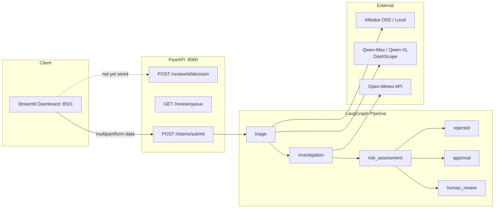

# Claimflow — Executive Project Status

> **Report date:** 2026-07-07  
> **Version:** 0.1.0  
> **Prepared for:** Hackathon final submission sprint

---

## Executive Summary

Claimflow is a **functionally complete MVP** for an AI-powered insurance claims autopilot. The technical core — FastAPI REST API, LangGraph multi-node agent pipeline, Qwen-Max/Qwen-VL integrations, Open-Meteo weather verification, storage abstraction, fail-closed security, and an enterprise-grade Streamlit dashboard — is implemented and demonstrable.

**Overall project health: 78 / 100 (Good)**

| Dimension | Score | Assessment |
|-----------|-------|------------|
| Core functionality | 92% | Pipeline works end-to-end; HITL UI not API-connected |
| Security | 75% | Fail-closed strong; missing rate limits and upload caps |
| Testing | 80% | 47/48 tests pass; no submit e2e or coverage report |
| Documentation | 55% | README solid; missing docs assets and deployment guide |
| Submission readiness | 45% | Product ready; collateral (video, license, Devpost) pending |

The project is **technically demo-ready today**. The primary risk to submission success is not code quality — it is **incomplete hackathon deliverables** (public repo, license, demo video, architecture diagram, Devpost entry).

---

## What Works Well

### 1. Agent Pipeline (LangGraph)
The graph implements a production-minded flow:

```
START → triage → investigation → risk_assessment
                              ├→ human_review → END
                              ├→ approval → END
                              └→ rejected → END
```

- **Triage:** Qwen-Max structured extraction + optional Qwen-VL cross-validation
- **Investigation:** LLM-driven tool decision → Open-Meteo weather verification
- **Risk assessment:** Sceptical LLM scoring with fail-closed penalties
- **Routing:** Configurable thresholds (`RISK_THRESHOLD=0.7`, `REJECT_THRESHOLD=0.9`)

### 2. Fail-Closed Security (Recently Hardened)
- Empty `extracted_data` → `fraud_risk_score = 1.0`, `HUMAN_REVIEW`
- Missing image analysis when image provided → +0.3 fraud penalty
- Missing weather verification when climate mentioned → +0.2 fraud penalty
- System errors → `fraud_risk_score = 1.0`, never auto-approve

### 3. Resilience
- LLM fallback chain: `qwen-max` → `qwen-plus` → `qwen-turbo` → MockLLM
- Vision fallback chain with access-denied detection
- `_wrap_safe_node` prevents unhandled exceptions from crashing the API
- Local storage fallback when OSS is unavailable

### 4. Frontend
The Streamlit dashboard (`streamlit_app.py`, ~850 lines) delivers:
- Enterprise B2B visual design (Alibaba orange / navy palette)
- Live `st.status()` pipeline animation
- Demo mode with 3 pre-built claim scenarios
- Human-in-the-loop UI with confirmation dialog and audit trail
- Technical details expander with raw API JSON

### 5. Test Suite
48 automated tests across 9 test files covering graph nodes, weather tool, vision service, storage, LLM fallback, review API, and mock graph integration.

---

## Risk Assessment

### 🔴 High Risk — Could Block Submission

| Risk | Impact | Likelihood | Mitigation |
|------|--------|------------|------------|
| No demo video published | Judges cannot evaluate product | High if not started | Record today using Demo Mode examples |
| ~~Proprietary license / no LICENSE file~~ | Resolved | MIT `LICENSE` added; `pyproject.toml` updated |
| Repo not public or broken setup | Judges cannot reproduce | Medium | Test fresh clone + `make install && make run` |
| DashScope models not purchased | Live demo uses MockLLM (high-fraud output) | Medium | Verify API key; capture console proof |

### 🟠 Medium Risk — Could Weaken Score

| Risk | Impact | Likelihood | Mitigation |
|------|--------|------------|------------|
| HITL not persisted to API | Track 4 human checkpoint appears cosmetic | Certain | Wire to `POST /review/{id}/decision` |
| In-memory claim store (no Postgres) | Data lost on server restart | High in dev | Document limitation; optional Postgres in `.env` |
| 1 failing test in CI | Looks unpolished if CI added | High | Fix env isolation in `test_health.py` |
| Missing architecture diagram | Harder for judges to understand system | High | Add Mermaid diagram to `docs/` |

### 🟢 Low Risk — Acceptable for Hackathon

| Risk | Impact | Mitigation |
|------|--------|------------|
| No rate limiting | Not needed for demo | Document as future work |
| No upload size limit | Edge case in demo | Add 10 MB cap if time permits |
| CORS missing port 8501 | Streamlit uses server-side `requests` | Add to CORS for completeness |
| Dependencies not pinned | Reproducibility | Acceptable for hackathon; lock later |

---

## Priority Action Items

Ordered by impact on submission success.

### 🔴 Critical (Next 2 Hours)

| # | Action | Owner | Est. | Done |
|---|--------|-------|------|------|
| 1 | Add `LICENSE` (MIT) and update README license section | Dev | 15 min | [ ] |
| 2 | Fix `test_health.py` env isolation | Dev | 15 min | [ ] |
| 3 | Record 3-minute demo video (Demo Mode Example 1 + 2) | Team | 90 min | [ ] |
| 4 | Push to public GitHub; verify README clone instructions | Dev | 20 min | [ ] |
| 5 | Capture DashScope / Alibaba Cloud console screenshots | Dev | 20 min | [ ] |

### 🟠 High (Before Devpost Deadline)

| # | Action | Owner | Est. | Done |
|---|--------|-------|------|------|
| 6 | Create `docs/architecture.md` with Mermaid diagram | Dev | 30 min | [ ] |
| 7 | Wire Streamlit HITL to review decision API | Dev | 60 min | [ ] |
| 8 | Add `docs/screenshot.png` of dashboard | Design | 10 min | [ ] |
| 9 | Complete Devpost submission (repo, video, blog links) | Team | 45 min | [ ] |
| 10 | Write short blog post / LinkedIn article | Team | 60 min | [ ] |

### 🟡 Medium (Polish If Time Permits)

| # | Action | Owner | Est. | Done |
|---|--------|-------|------|------|
| 11 | Add `test_claims_submit.py` integration test | Dev | 45 min | [ ] |
| 12 | Add GitHub Actions CI (lint + test) | Dev | 45 min | [ ] |
| 13 | Add `Dockerfile` + `docker-compose.yml` | Dev | 90 min | [ ] |
| 14 | Enforce 10 MB upload size limit | Dev | 20 min | [ ] |
| 15 | Add `pytest-cov` coverage report | Dev | 15 min | [ ] |

---

## Time Estimates for Remaining Work

| Workstream | Minimum (submission-ready) | Recommended (competitive) |
|------------|--------------------------|---------------------------|
| Code fixes (test, HITL API, CORS) | 1.5 hours | 3 hours |
| Documentation (diagram, screenshot) | 45 minutes | 2 hours |
| Submission collateral (video, Devpost, blog) | 3 hours | 5 hours |
| DevOps polish (CI, Docker) | — | 3 hours |
| **Total** | **~5 hours** | **~13 hours** |

---

## Architecture Snapshot



---

## Test Health

```
48 tests collected
47 passed ✅
1 failed  ❌  test_health_endpoint (PROJECT_NAME env bleed from local .env)
```

**Recommendation:** Patch environment in test fixture or pass explicit `Settings` to `create_app()` to prevent local `.env` from affecting CI.

---

## Environment & Dependencies

| Component | Status |
|-----------|--------|
| Python | 3.11+ required, tested on 3.12 |
| Package manager | `pyproject.toml` + hatchling |
| Virtual env | `.venv/` via `make install` |
| Database | Optional PostgreSQL; in-memory default |
| Storage | `STORAGE_BACKEND=local` (default) or `oss` |
| Frontend deps | `streamlit`, `requests` in main dependencies |

---

## Submission Checklist Cross-Reference

For the full itemized checklist with checkbox status, see **[`CHECKLIST.md`](../CHECKLIST.md)** at the project root.

---

## Sign-Off Criteria

The project is **submission-ready** when all of the following are true:

- [ ] `make test` passes 48/48
- [ ] `make run` + `make run-frontend` demo works without MockLLM (live Qwen)
- [ ] Public GitHub repo with MIT license
- [ ] Demo video uploaded and linked in Devpost
- [ ] Architecture diagram in `docs/`
- [ ] Alibaba Cloud usage proof attached
- [ ] HITL decision flow demonstrated (UI minimum; API preferred)

---

*This document should be updated after each sprint checkpoint. Next review recommended: after demo video recording.*
