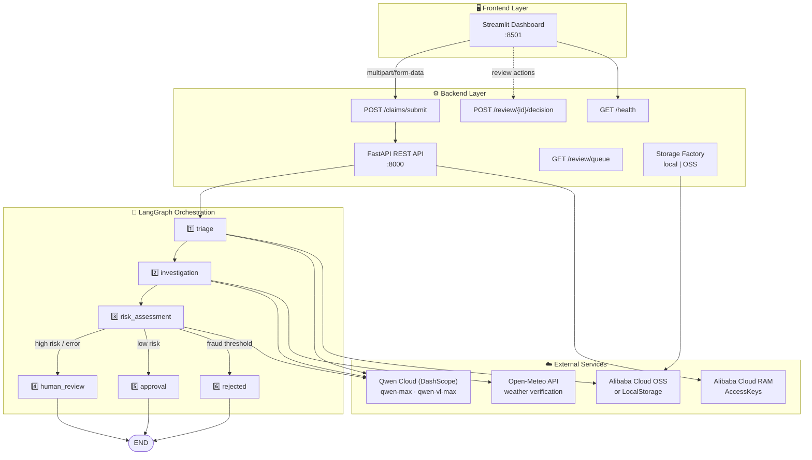

# Claimflow Architecture

> **Version:** 0.1.0 · **Last updated:** 2026-07-07  
> Claimflow is an AI-powered insurance claims autopilot built with **FastAPI**, **LangGraph**, and **Alibaba Cloud Qwen (DashScope)**.


---

## 🏗️ System Overview

Claimflow follows a four-layer architecture: a Streamlit frontend, a FastAPI backend, a LangGraph agent orchestration layer, and external cloud/API services.



> **Render this diagram:** Copy the Mermaid block into [mermaid.live](https://mermaid.live) to export PNG/SVG for presentations.

---

## 📨 Data Flow — Typical Claim (Step by Step)

| Step | Layer | What Happens |
|------|-------|--------------|
| **1** | 🖥️ Frontend | User submits raw claim text (+ optional damage photo) via Streamlit or `POST /api/v1/claims/submit`. |
| **2** | ⚙️ Backend | FastAPI validates input, uploads image via storage factory (`local` or `OSS`), assigns a `claim_id`, and invokes the compiled LangGraph. |
| **3** | 🔀 Triage | **Qwen-Max** extracts structured fields (`cliente_nome`, `tipo_dano`, `localizacao`, `data_incidente`). If an image exists, **Qwen-VL** analyses it and computes a text↔image consistency score. |
| **4** | 🔀 Investigation | **Qwen-Max** returns a `ToolDecision`. When the claim mentions weather/climate, the node calls `get_weather_history` (Open-Meteo) with extracted location and date. |
| **5** | 🔀 Risk Assessment | **Qwen-Max** evaluates fraud risk and severity using triage data, vision analysis, and weather verification. Fail-closed penalties apply for missing evidence. |
| **6** | 🔀 Routing | Composite score vs `RISK_THRESHOLD` (0.7) and `REJECT_THRESHOLD` (0.9) determines the terminal node. |
| **7** | ⚙️ Backend | Final state is persisted (in-memory or PostgreSQL) and returned as JSON to the client. |
| **8** | 🖥️ Frontend | Dashboard displays status, scores, pipeline animation, and — for `HUMAN_REVIEW` claims — adjuster decision UI. |

### Pipeline sequence

```
START → triage → investigation → risk_assessment
                              ├→ human_review → END
                              ├→ approval      → END
                              └→ rejected      → END
```

---

## 🔀 The 6 LangGraph Nodes

| # | Node | Emoji | Responsibility |
|---|------|-------|----------------|
| 1 | **`triage`** | 📋 | Parse raw claim text with **Qwen-Max** structured output (`TriageResult`). Run **Qwen-VL** vision analysis when an image is attached. Compute text↔image consistency score. |
| 2 | **`investigation`** | 🔍 | LLM decides whether external verification is needed. Invokes `get_weather_history` (Open-Meteo) when climate events are mentioned. |
| 3 | **`risk_assessment`** | ⚖️ | Sceptical LLM scoring (`RiskAssessmentResult`): `fraud_risk_score`, `severity_score`, `requires_human_review`. Applies fail-closed penalties. Routes to terminal nodes. |
| 4 | **`human_review`** | 👤 | Confirms escalation to the adjuster queue. Claim awaits human decision via `GET /review/queue` and `POST /review/{id}/decision`. |
| 5 | **`approval`** | ✅ | Auto-approves low-risk claims (composite score below `RISK_THRESHOLD`, no material doubts). |
| 6 | **`rejected`** | ❌ | Auto-rejects high-fraud claims (composite score ≥ `REJECT_THRESHOLD`). |

**Source:** [`src/claimflow/agents/graph.py`](../src/claimflow/agents/graph.py)

---

## 🔒 Fail-Closed Security Design

Claimflow **never auto-approves when evidence is missing or unreliable**. Ambiguity escalates to human review or rejection.

| Condition | Behaviour |
|-----------|-----------|
| Empty `extracted_data` after triage | `fraud_risk_score = 1.0` → **HUMAN_REVIEW** |
| Image provided but vision analysis unavailable | +0.3 fraud penalty |
| Weather mentioned but verification unavailable | +0.2 fraud penalty |
| LLM / vision / tool unrecoverable error | `system_error = true`, `fraud_risk_score = 1.0` → **HUMAN_REVIEW** |
| Severe text↔image mismatch (consistency &lt; 0.3) | Pre-triage fraud score = 0.85 |
| Unhandled node exception | `_wrap_safe_node` catches, escalates — API never crashes |

**Principle:** *When in doubt, escalate — never silently approve.*

Configurable thresholds (`.env`):

- `RISK_THRESHOLD=0.7` — route to human review
- `REJECT_THRESHOLD=0.9` — auto-reject

---

## 👤 Human-in-the-Loop Pattern

High-risk or ambiguous claims are **paused with a real LangGraph interrupt** before `human_review` runs — not merely stamped and ended.

```
risk_assessment
      │
      ├── composite ≥ 0.9 ──────────► rejected → END
      ├── composite ≥ 0.7 or flags ─► ⏸ interrupt_before human_review
      │                                      │
      │                              adjuster POST /decision
      │                                      │
      │                              update_state + ainvoke resume
      │                                      │
      │                              human_review → END
      └── low risk ─────────────────► approval → END
```

Full walkthrough (sequence diagram, failure modes, demo tip): **[HITL_INTERRUPT.md](HITL_INTERRUPT.md)**.

### API endpoints

| Endpoint | Purpose |
|----------|---------|
| `GET /api/v1/review/queue` | List claims awaiting review |
| `GET /api/v1/review/{claim_id}` | Full claim snapshot for adjuster |
| `POST /api/v1/review/{claim_id}/decision` | `aupdate_state` + resume graph, then persist decision |

### Streamlit UI

The dashboard shows **“Waiting for human decision…”** while `awaiting_human_decision` / `graph_interrupted` is true, then Approve/Reject controls that resume the graph. Demo Mode includes pre-built fraud and legitimate scenarios.

---

## 🔗 Multimodal Cross-Validation

Claimflow cross-checks **three evidence channels** before final routing:

```
┌─────────────┐     ┌─────────────┐     ┌─────────────┐
│  📝 Text     │     │  🖼️ Image    │     │  🌦️ Weather  │
│  Qwen-Max   │     │  Qwen-VL    │     │  Open-Meteo │
│  triage     │     │  triage     │     │  investig.  │
└──────┬──────┘     └──────┬──────┘     └──────┬──────┘
       │                   │                   │
       └─────────┬─────────┴─────────┬─────────┘
                 ▼                   ▼
          consistency_score    weather_verification
                 │                   │
                 └────────┬──────────┘
                          ▼
                  ⚖️ risk_assessment
                  (merged fraud score)
```

| Signal | Source | Example inconsistency |
|--------|--------|----------------------|
| **Text** | Claim narrative → `tipo_dano` | Customer reports *fire* |
| **Image** | Qwen-VL → `detected_damage_type` | Photo shows *water damage* |
| **Weather** | Open-Meteo historical data | Claim says *storm* but records show *sunny* |

**Consistency scoring** (`VisionService.compute_consistency_score`):

- `1.0` — exact category match (e.g. FOGO ↔ FOGO)
- `0.5` — one side ambiguous (`OUTRO`)
- `0.0` — clear mismatch (e.g. FOGO ↔ AGUA) → fraud signal

---

## 📁 Key Source Files

| File | Role |
|------|------|
| [`src/claimflow/agents/graph.py`](../src/claimflow/agents/graph.py) | LangGraph pipeline definition |
| [`src/claimflow/services/llm_service.py`](../src/claimflow/services/llm_service.py) | DashScope Qwen text integration |
| [`src/claimflow/services/vision_service.py`](../src/claimflow/services/vision_service.py) | Qwen-VL multimodal analysis |
| [`src/claimflow/tools/weather_tool.py`](../src/claimflow/tools/weather_tool.py) | Open-Meteo weather verification |
| [`src/claimflow/api/routes/claims.py`](../src/claimflow/api/routes/claims.py) | Claim submission endpoint |
| [`src/claimflow/api/routes/review.py`](../src/claimflow/api/routes/review.py) | Human-review API |
| [`streamlit_app.py`](../streamlit_app.py) | Enterprise dashboard frontend |

---

## 🔗 Related Documentation

- [Alibaba Cloud Integration Proof](ALIBABA_CLOUD_PROOF.md)
- [Deployment Guide](DEPLOYMENT.md)
- [Project Status](PROJECT_STATUS.md)
